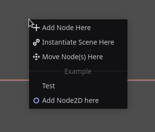
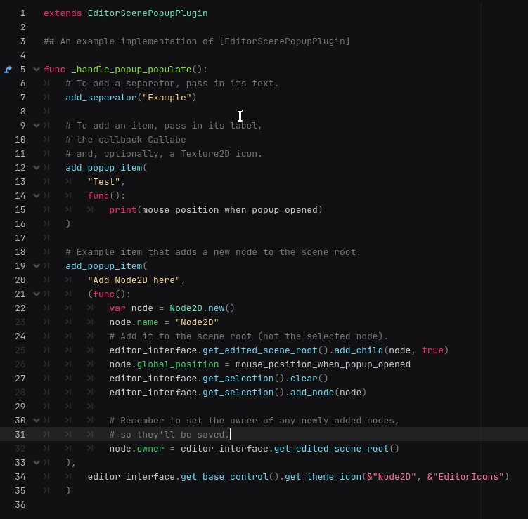

# Godot PopupTools Addon

## Description

Allows you to add new items to your `CanvasItemEditor` for faster level editing.  
The items can be added conditionally based on which nodes you are selecting, etc,
since they are regenerated every time the popup menu is opened.

  

## Features

- Add new `Callable` entries to your `CanvasItemEditor`.

## Roadmap

Seems complete, to be honest.
Just a tiny plugin.
